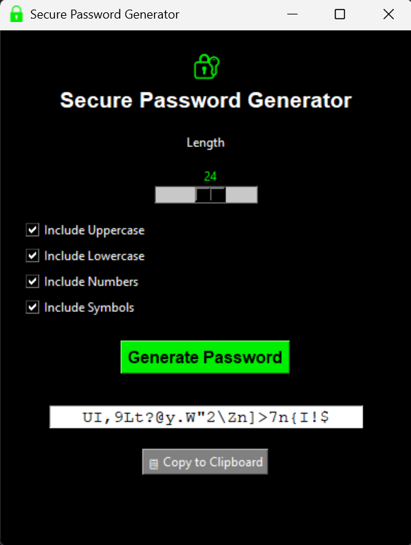

# 🔐 Secure Password Generator

A lightweight, standalone desktop application for generating strong and customizable passwords.  
Built with Python and Tkinter, designed with a hacker-friendly dark interface and green neon style.



---

## 🚀 Features

- Generate passwords up to **40 characters**
- Include **uppercase**, **lowercase**, **numbers**, and **symbols**
- Instantly **copy passwords** to clipboard
- No installation required — just run the `.exe`
- Minimalist and secure design

---

## 📦 Download

**Latest release**:  
👉 [Download `.exe`](https://github.com/Francismirror/Secure_Password_Generator/releases/latest)

- ✅ Windows-compatible `.exe`
- ❌ No Python required
- 📁 Portable — runs from USB

---

## 🛠️ How to Run (for developers)

### Requirements

- Python 3.10+
- `pyperclip` library (clipboard support)

Install dependencies:

```bash
pip install pyperclip
